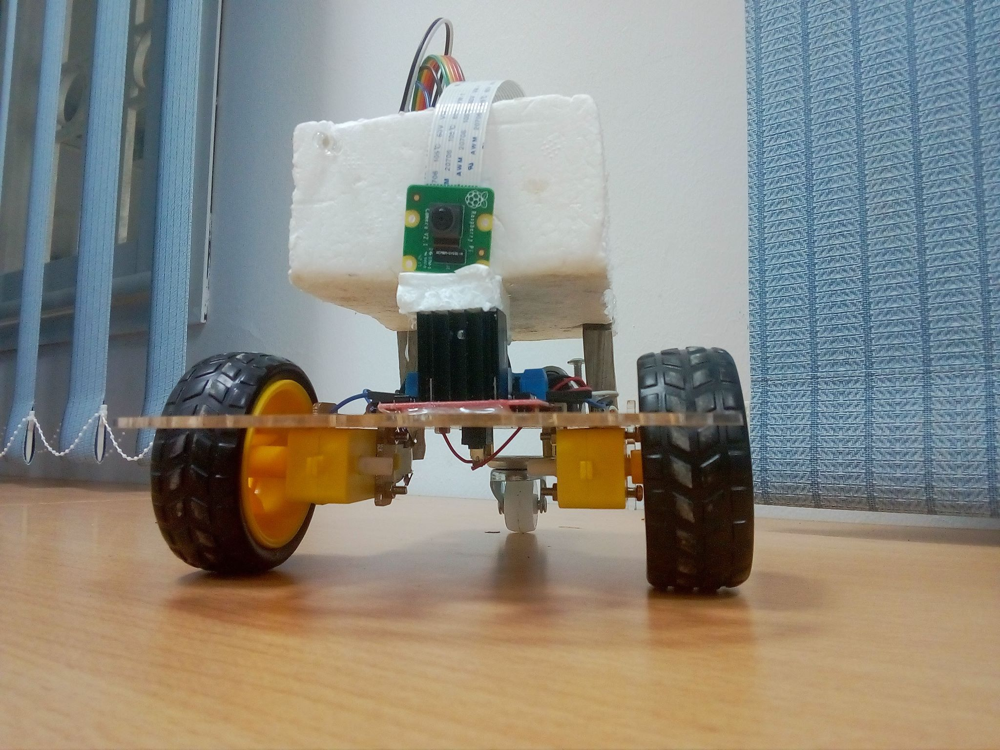
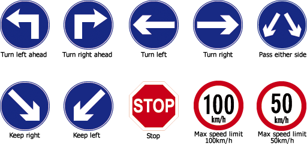

# Self driving car Project "Mercury"     
## Traffic sign recognition  
Mercury is a WIP prototype of a self driving car, the first model focuses on traffic sign recognition using Deep Learning (CNN).  
Dataset : [German Traffic Sign Dataset](http://benchmark.ini.rub.de/?section=gtsrb&subsection=dataset)  
  
Here's an overview of Mercury 1.0 :  
  
 
  
Signs the AI currently recognizes :  
  
  
###### NB : The AI is only trained with 5 signs (50, 120, Right, Left, Stop) but the variation the dataset allows it to recognize all the signs displayed above.  
### 1. Dependencies  
* Python3.7, Jupyter, NumPy, SciPy, TensorFlow, Keras, Matplotlib, Pandas, OpenCV, Skimage, pillow  
* OS (RaspberryPi) : Raspbian  
### 2. Hardware  
* RaspberryPi 3 B+, 8MP PiCamera, 2DC motors, L298n h-bridge, 2 KY 033 optic sensors  
###### NB : We used optic sensors to keep the robot movement in a straight line, if you are planing to use 4 DC motors or other alternatives you won't need them  
[**Video demonstration**](https://www.youtube.com/watch?v=oamXh6avUcY&feature=youtu.be)
