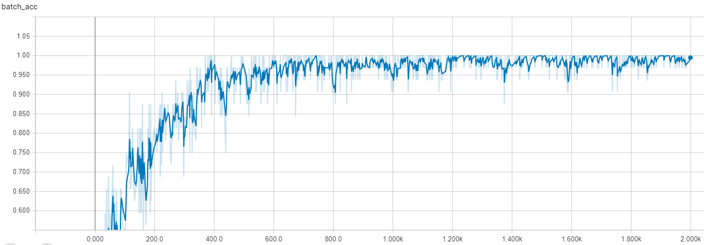
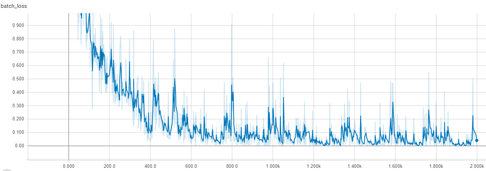
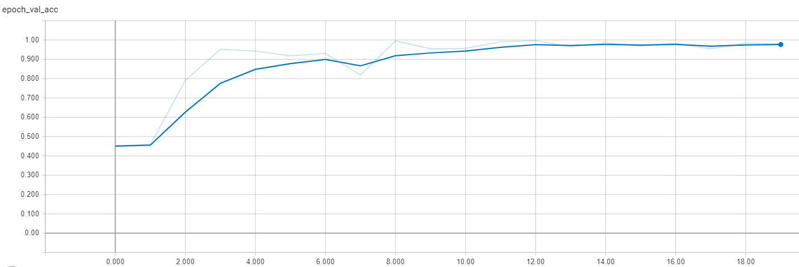
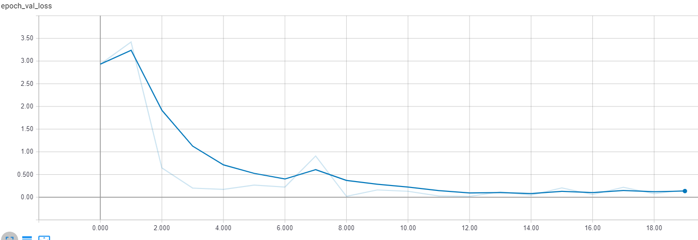

# Smart car Project "Mercury"
## Objectif: Building a traffic signs classifier  
### 1. Organizing test images  
Unlike the training images the data provided for the test is not organsied per class  
```python
data = pd.read_csv('.../GT-final_test.csv', sep=';')
pictures_folder = '...'
target = 'Test_full'

#creating multiple folders inside the main folder 
for i in range (0,43):
        os.mkdir('.../Test_full/' + str(i))

#puting every picture in its associated class folder
for item in tqdm(range(0, data.shape[0])):
    picture_name = data['Filename'][item]
    picture = Image.open(pictures_folder + '/' + picture_name)
    picture_class = data['ClassId'][item]
    picture.save('Test_full/' + str(picture_class) + '/' + picture_name)
```  
### 2. Picking the signs to work with
Since we plan to implement this model in a robot using RaspberryPi we decided to focuse on a small numbers of signs for better performance.    
  
| Num | Sign |  
| --- | --- |  
| 2 | Speed limit (50km/h) |  
| 7 | Speed limit (100km/h) |  
| 14 | Stop |  
| 33 | Turn right | 
| 34 | Turn left |  
  
### 3. Data augmentaion 
###### NB : don't rotate the direction signs !  
```python  
labels = os.listdir(".../data/train")
for label in labels: 
	number_files = len(os.listdir(".../data/train/" + label))
	print ("number of files in ", label, number_files) 
	
def augment_data(label_path):
	label = label_path.split('/')[-1]
	if label == "120":
		files = os.listdir(label_path)
		for file in files:
			file_name = file.split(".")[0]
			file_ext = file.split(".")[1]
			img = Image.open(label_path + "/" + file)
			img_rotate_90 = img.rotate(90)
			img_rotate_90.save(label_path + "/" + file_name + "rotate_90." + file_ext)
	if label == "Stop":
			files = os.listdir(label_path)
			for file in files:
				file_name = file.split(".")[0]
				file_ext = file.split(".")[1]
				img = Image.open(label_path + "/" + file)
				img_rotate_90 = img.rotate(90)
				img_rotate_120 = img.rotate(120)
				img_rotate_90.save(label_path + "/" + file_name + "rotate_90." + file_ext)
				img_rotate_120.save(label_path + "/" + file_name + "rotate_120." + file_ext)
	if label == "Right":
			files = os.listdir(label_path)
			for file in files:
				file_name = file.split(".")[0]
				file_ext = file.split(".")[1]
				img = Image.open(label_path + "/" + file)
				img_enhance = img.filter(ImageFilter.EDGE_ENHANCE())
				img_edge = img.filter(ImageFilter.FIND_EDGES())
				img_enhance.save(label_path + "/" + file_name + "enhance." + file_ext)
				img_edge.save(label_path + "/" + file_name + "edge." + file_ext)
	if label == "Left":
			files = os.listdir(label_path)
			for file in files:
				file_name = file.split(".")[0]
				file_ext = file.split(".")[1]
				img = Image.open(label_path + "/" + file)
				img_enhance = img.filter(ImageFilter.EDGE_ENHANCE())
				img_edge = img.filter(ImageFilter.FIND_EDGES())
				img_gaussian = img.filter(ImageFilter.GaussianBlur(radius = 3))
				img_invert = ImageChops.invert(img)
				img_enhance.save(label_path + "/" + file_name + "enhance." + file_ext)
				img_edge.save(label_path + "/" + file_name + "edge." + file_ext)
				img_gaussian.save(label_path + "/" + file_name + "gaussian." + file_ext)
				img_invert.save(label_path + "/" + file_name + "invert." + file_ext)

for label in labels:
	print("augmenting data in ", label)
	label_path = "../data/train/" + label
	try:
		augment_data(label_path)
	except:
		print("bug in ", label)  
```  
### 4. CNN using Keras and Tensorflow 
```python  
classifier = Sequential()

classifier.add(Conv2D(64, (3, 3), input_shape=(32, 32, 3), activation='relu'))
classifier.add(MaxPooling2D(pool_size=(2, 2)))
classifier.add(BatchNormalization())


classifier.add(Conv2D(128, (3, 3), activation='relu'))
classifier.add(MaxPooling2D(pool_size=(2, 2)))
classifier.add(BatchNormalization())


classifier.add(Conv2D(256, (3, 3), activation='relu'))
classifier.add(MaxPooling2D(pool_size=(2, 2)))
classifier.add(BatchNormalization())


classifier.add(Flatten())
classifier.add(Dense(units=512, activation='relu'))
classifier.add(Dropout(rate=0.2))

classifier.add(Dense(units=256, activation='relu'))
classifier.add(Dropout(rate=0.2))

classifier.add(Dense(units=128, activation='relu'))
classifier.add(Dropout(rate=0.2))

classifier.add(Dense(units=64, activation='relu'))
classifier.add(Dropout(rate=0.2))

classifier.add(Dense(units=32, activation='relu'))
classifier.add(Dropout(rate=0.2))

classifier.add(Dense(units=16, activation='relu'))
classifier.add(Dropout(rate=0.2))

classifier.add(Dense(units=5, activation='softmax'))

tensorboard = TensorBoard(log_dir="logs/{}".format(time()))

classifier.compile(optimizer='adam', loss='categorical_crossentropy', metrics=['accuracy'])


from keras.preprocessing.image import ImageDataGenerator

train_datagen = ImageDataGenerator(rescale=1. / 255,
                                   shear_range=0.2,
                                   zoom_range=0.2,
                                   horizontal_flip=False)

test_datagen = ImageDataGenerator(rescale=1. / 255)

training_set = train_datagen.flow_from_directory(".../data/train",
                                                 target_size=(32, 32),
                                                 batch_size=32,
                                                 class_mode='categorical')

test_set = test_datagen.flow_from_directory(".../data/test",
                                            target_size=(32, 32),
                                            batch_size=32,
                                            class_mode='categorical')
classifier.summary()  

classifier.fit_generator(training_set,
                         steps_per_epoch=100,
                         epochs=20,
                         validation_data=test_set,
                         validation_steps=100,
                         shuffle=True,callbacks=[tensorboard])
```  
### 5. Training results  
Batch accuracy :  
  
  
  
Bactch loss :  
  
  
  
Val accuracy :  
  
  
  
Val loss :  
  
  

